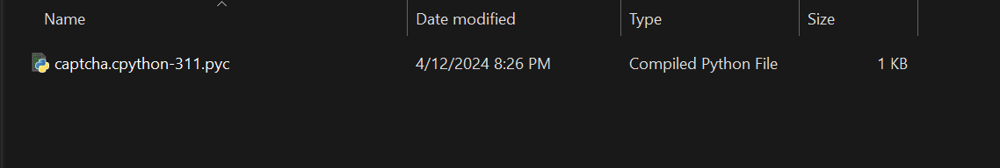

<h1>PYTHON CODE TO CREATE A STATIC CAPTCHA</h1>

This code requires you to install a library called as "captcha" by   # pip install captcha 

when you run the code you will get a new file in the destination by the extension of .pyc   on clicking that the terminal opens and then a few seconds later the photos open and you can see the captcha   I am using VS Code but you can ofcourse use any other IDE you wish.

